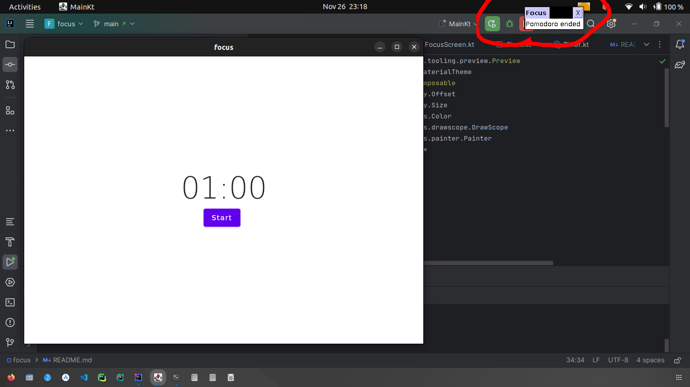

# Focus

A desktop Pomodoro app to improve focus and efficiency on tasks.
This is a personal project and although there are many of such applications, I wanted to
create one to create one that is highly suited for me. And, also along the way,
reinforce my knowledge of Jetpack Compose and learn how to apply it in the unfamiliar context of a desktop application.

## Roadmap

**To be updated**

## Project Status

The project is **in the early stages of planning and design**.

Currently, the project is basically a playground for messing
around with coroutines and Compose for Desktop.

### Update: 26/11/2023

Tried to add notifications, for when the timer is done and I got a very dated notification (in Ubuntu).

This result is making me reconsider using Compose Desktop for this app as notifications
contribute a lot to the user experience. For Mac, as shown in
the [Compose Desktop docs](https://github.com/JetBrains/compose-multiplatform/blob/master/tutorials/Tray_Notifications_MenuBar_new/README.md)
on notifications, the results are quite OK. However, notifications on Windows are also dated as per 
[this article](https://www.composables.com/tutorials/compose-desktop).

I think I may redo this as strictly an Android application if I do not find a workaround that
does not involve me writing a notification system myself.

N/B: At the time stated above, the time is counting up for one minute for testing purposes.

### Update: 29/11/2023
Decided to make it a Compose Multiplatform project for Android and Desktop. 